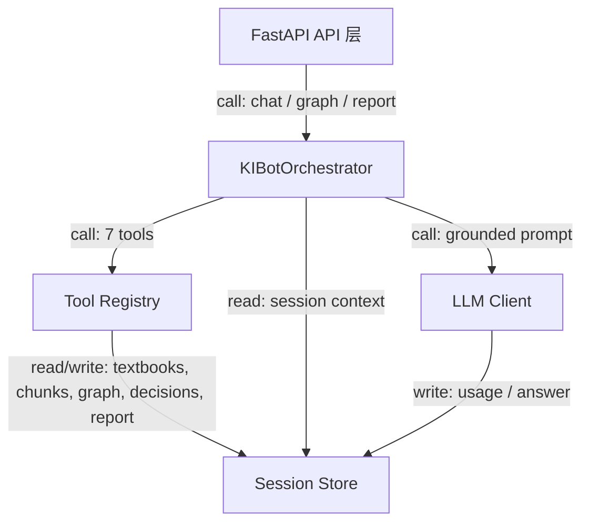

# KIBot Agent 架构说明

## 总体架构



主链路保持单入口：FastAPI 接收请求，Orchestrator 负责选择工具、读取 session 事实源、必要时调用 LLM，并把回答、token usage 或教师修改写回 Session Store。

## 设计原则

KIBot 第一版采用 single-orchestrator first。原因是比赛演示更需要稳定、可解释的主链路：教材解析、图谱、RAG、教师复核、报告生成应共享同一个 session 事实源，避免多个 agent 同时写状态造成不可复现结果。

同时，数据结构和工具边界保持 cluster-ready：未来可以把“教材解析 agent”“图谱 agent”“融合 agent”“报告 agent”拆分为协作节点，但它们仍通过同一个 session store 读写结构化状态。

## 单 Orchestrator

`KIBotOrchestrator` 当前职责：

- 从 session 构造上下文。
- 调用 session-grounded tools 获取教材、压缩统计、token、图谱、融合决策、报告状态。
- 对状态类问题返回 deterministic summary，减少不必要 LLM 调用。
- 对解释类问题调用 LLM，并在 system prompt 中限制只能使用提供的 session context。

这让系统在没有 LLM key 时仍能提供可演示的状态摘要。

## Tool Registry

当前工具以 Python 模块方式组织，可视为轻量 tool registry：

- `get_selected_textbooks(session)`
- `get_compression_stats(session)`
- `get_token_usage(session)`
- `get_graph_summary(session)`
- `get_integration_decisions(session)`
- `update_decision(session, decision_id, action, teacher_note)`
- `get_report(session)`

工具只接收 session 或明确参数，不直接依赖聊天历史。后续扩展多 agent 时，可把这些函数包装为显式 tool schema，由 orchestrator 或 agent cluster 统一调度。

## 架构方案对比

| 方案 | 适用阶段 | 优点 | 代价估计 | 调试难度 |
| --- | --- | --- | --- | --- |
| Single Orchestrator | P0 演示与闭环 | 状态单一、可重放、低延迟 | 每轮约 1 次 LLM，2k-8k input tokens | 2/5 |
| LangGraph | P1 复杂流程 | 有状态图、分支清晰、适合人工审核节点 | 每轮约 2-4 次 LLM，6k-20k input tokens | 3/5 |
| CrewAI | P2 多角色探索 | 角色拆分自然，适合头脑风暴式任务 | 每轮约 4-8 次 LLM，15k-50k input tokens | 4/5 |

当前选择 Single Orchestrator，是为了把 token 成本、状态一致性和比赛现场调试压力控制在可解释范围内。LangGraph 更适合后续把“抽取-融合-复核-报告”做成显式流程图；CrewAI 更适合多 agent 研究型扩展，不作为首版主链路。

## Session State

Agent 不把聊天记录当作唯一记忆。结构化 session 是事实源：

- 教材与章节：来自解析结果。
- chunk：来自 chunker。
- graph：来自 graph build API。
- integration decisions：由融合流程和教师修改写入。
- report：由报告生成流程写入。
- messages：可保存对话过程，但不替代结构化字段。

这种设计便于重放、调试和评委检查。

## Context Compaction

长对话下，Agent 上下文应按以下规则压缩：

1. 保留 session id、选中教材、图谱摘要、压缩统计、token usage。
2. 对历史消息抽取 `memory_summary`，只保存教师偏好、已确认决策、未完成问题。
3. 大体量教材正文不直接进入 prompt，只通过 RAG 检索片段进入。
4. 教师确认或修改必须写回 `integration_decisions`、`report` 或图谱字段，而不是只写入 `memory_summary`。

当前代码已有 `memory_summary` 字段和 orchestrator 读取逻辑；自动 compaction 策略可在后续 agent/chat API 中补齐。

## Token Observability

`TokenUsage` 包含：

- `calls`
- `input_tokens`
- `output_tokens`
- `total_tokens`

LLM client 优先使用 provider 返回的 `usage`；如果 provider 不返回 usage，则按字符数估算。工具层通过 `get_token_usage(session)` 暴露统计，便于前端展示成本、压缩率和调用次数。

## Prompt Engineering

### 图谱抽取 few-shot

system prompt 固定要求：

- 只抽取教材片段中明确出现的概念和关系。
- 节点名使用教材原文或等价短语，不扩写成外部知识。
- 关系类型限制在 `包含`、`前置`、`解释`、`对比`、`应用`。
- 输出 JSON，包含 `nodes`、`edges`、`evidence`、`confidence`。

few-shot 示例保持短小：

```json
{
  "chunk": "函数由定义域、值域和对应法则构成。一次函数是函数的一类。",
  "output": {
    "nodes": ["函数", "定义域", "值域", "对应法则", "一次函数"],
    "edges": [
      {"source": "函数", "target": "定义域", "type": "包含"},
      {"source": "函数", "target": "值域", "type": "包含"},
      {"source": "函数", "target": "对应法则", "type": "包含"},
      {"source": "一次函数", "target": "函数", "type": "解释"}
    ],
    "evidence": ["函数由定义域、值域和对应法则构成", "一次函数是函数的一类"],
    "confidence": 0.86
  }
}
```

### 防幻觉策略

- Retrieved chunks only：LLM 只能使用 RAG 返回片段和 session summary，不允许补充外部教材知识。
- Confidence output：每个答案、节点合并和关系抽取都输出 `confidence`；低于阈值时标记为待教师复核。
- JSON schema validation：LLM 输出先过 schema 校验；失败时不进入图谱写入。
- Fallback to rules：schema 失败或置信度过低时，退回规则抽取、BM25 证据排序和人工复核队列。

## Cluster-ready 方案

后续多 agent 集群可以按职责拆分：

- Corpus Agent：负责教材解析、章节质量检查、chunk 状态。
- Graph Agent：负责概念抽取、关系构建、图谱解释。
- Integration Agent：负责跨教材去重、合并、保留、冲突标记。
- Report Agent：负责生成 Markdown 报告和引用清单。
- Review Agent：负责教师反馈落库和变更审计。

集群模式下仍建议由一个 coordinator 持有写权限，其他 agent 输出建议或 patch，避免并发覆盖 session 状态。

## Roadmap

- P0：BM25 检索。先保证教材片段召回稳定，所有回答和图谱抽取都能追溯到 chunk evidence。
- P1：LLM secondary dedup。对规则去重后的候选概念做二次语义合并，输出合并理由、证据和置信度。
- P2：Multi-agent cluster。拆分 Corpus、Graph、Integration、Report、Review agents，但保留 coordinator 单点写入 session。

## 评分标准逐项对照

### D. Agent 架构设计

| 子项 | 评分要求 | 文档/代码对应 |
| --- | --- | --- |
| 架构总览与清晰度 | 架构描述、职责清晰、Mermaid 图 | 本文“总体架构” Mermaid；`backend/agent/orchestrator.py`；`backend/tools/*` |
| 设计决策论证 | 说明为什么单 Agent，讨论替代方案 | “设计原则”和“架构方案对比”解释 Single Orchestrator vs LangGraph vs CrewAI，并给出 token/调试成本估算 |
| RAG Pipeline 设计 | 分块、embedding、检索、引用 | `backend/services/chunker.py` 使用 700/80；`backend/services/retriever.py` 使用 BM25 + hashed vector embedding + concept/chapter boost |
| Prompt 工程 | 格式约束、few-shot、防幻觉 | “Prompt Engineering” 章节；graph prompt 要求 JSON schema、confidence、evidence |
| 已知局限与改进 | 局限和具体路线图 | “Roadmap”和“Cluster-ready 方案” |

### P0 主链路

1. 上传教材：FastAPI `textbooks` router 负责流式保存文件，parser 输出统一 schema。
2. 构建图谱：Graph API 先尝试 LLM 抽取，失败回退 deterministic graph，保证演示可用。
3. 跨教材整合：Integration API 写入结构化决策，action 覆盖 merge/keep/remove/split。
4. RAG 问答：Retriever 返回 top-5 chunk、citation 和分数组成，LLM prompt 限定 retrieved chunks only。
5. 教师复核：DialogueService 解析 explain/keep/remove/merge/split，并写回决策、图谱状态和 report stale note。

### P1 加分链路

- 混合检索：BM25 负责精确术语召回，hashed vector embedding 负责轻量向量相似度，concept/chapter boost 做重排序。
- 可视化增强：ECharts graph + Sankey；颜色、大小、形状三维映射；搜索和点击详情。
- 成本观测：`TokenUsage` 在 LLM client、graph client 和前端 Token 面板中贯通。
- Docker 部署：Dockerfile 在镜像中构建 React dist 并启动 FastAPI，魔搭运行端口 7860。

### P2 技术报告候选

题目建议：`低成本混合 RAG 在多教材整合中的效果分析`。

实验设计可以直接复用当前工程：

| 实验组 | 检索策略 | 预计观察 |
| --- | --- | --- |
| Baseline | term overlap | 对重复医学术语有召回，但排序不稳定 |
| BM25 | BM25Okapi | 重复关键术语得分更合理 |
| BM25 + vector | BM25 + hashed vector cosine | 在无 BM25 或短 query 情况下仍保留向量相似度信号 |
| Hybrid | BM25 + vector + concept/chapter | 更贴近教学章节和图谱概念 |

已有自动化证据：`tests/test_retriever.py` 覆盖 BM25 排序、向量分数参与、未选教材隔离和 RAG API fallback。赛后可扩展为 20-50 个教师问题，计算 top-1/top-5 命中率、引用准确率、响应时间和 token 消耗。

## 创新点说明

1. Session-grounded tool registry：所有 Agent 回答先读取 session facts，再决定是否调用 LLM，避免把聊天历史当事实源。
2. Deterministic-vs-LLM 成本路由：状态类问题走 deterministic summary，解释类问题才调用 LLM，降低 token 成本。
3. 混合 RAG fallback：在无法下载大 embedding 模型的比赛环境中，用 hashed vector embedding 提供可解释、零依赖的向量检索信号，同时保留未来替换 BGE/FAISS 的接口。
4. 教师反馈写回结构化状态：keep/remove/merge/split 不只存在聊天文本中，会更新 integration decision、graph status 和 report stale 标记。
5. 可视化整合流：Sankey 把“教材来源 -> 整合概念”的压缩路径可视化，补充 force graph 难以表达的去重过程。
